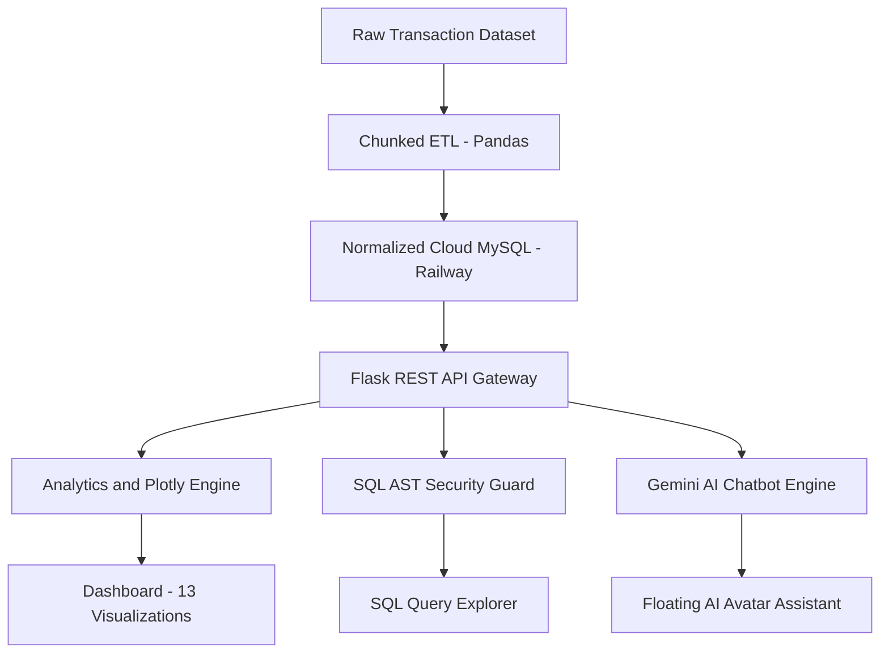
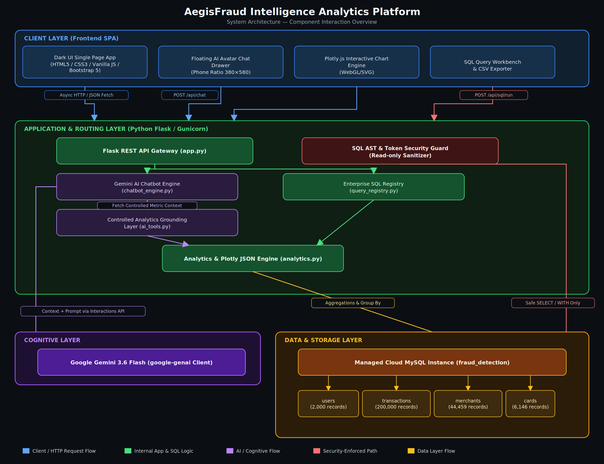

# 🛡️ AegisFraud – Enterprise Fraud Intelligence Dashboard

AegisFraud is an **enterprise-grade fraud detection analytics platform** that turns 200,000+ raw credit card transactions into live executive intelligence.
It combines a real-time analytical dashboard, a governed SQL workbench, and a Gemini-powered virtual analyst — all backed by a hardened, read-only-by-default data layer.

---

## 📖 Introduction

Fraud teams don't just need dashboards — they need trustworthy, real-time answers about where money is being lost and why.
AegisFraud addresses this by ingesting a full transactional dataset (users, cards, merchants, transactions) into a normalized cloud MySQL schema, computing statistical and multi-factor risk signals, and surfacing them through 13 interactive visualizations and a governed natural-language assistant.

The system focuses on:
- Accurate, explainable fraud signals (Z-Score + IQR outlier detection, multi-factor risk scoring)
- A clean, dark-themed executive interface
- Sub-200ms query performance at 200K+ row scale
- Production-grade security on a publicly exposed database connection



## 📂 Project Structure

```
AegisFraud-Dashboard/
│
├── backend/
│   ├── __init__.py
│   ├── app.py                   # Flask REST API Gateway & routing
│   ├── config.py                # Environment & database configuration
│   ├── database.py               # MySQL connector engine
│   ├── analytics.py              # KPI calculations & Plotly JSON engine
│   ├── query_registry.py         # Enterprise SQL business-module catalog
│   ├── chatbot_engine.py         # Gemini virtual avatar assistant engine
│   └── ai_tools.py               # Controlled analytics grounding layer
│
├── sql/
│   ├── database_creation.sql
│   ├── users_table_creation.sql
│   ├── card_table_creation.sql
│   ├── merchant_table_creation.sql
│   ├── transaction_table_creation.sql
│   ├── fraud_detection.sql
│   ├── basic_data_analysis.sql
│   ├── customer_analysis.sql
│   ├── card_analysis.sql
│   ├── merchant_analysis.sql
│   ├── transaction_analysis.sql
│   ├── advanced_fraud_analysis.sql
│   ├── final_buisness_insights.sql
│   └── database_validation.sql
│
├── dataset_cleaned/
│   ├── users_clean.csv
│   ├── cards_clean.csv
│   ├── merchants_clean.csv
│   └── transactions_clean.csv
│
├── Notebook/
│   ├── Aegis_Fraud_Detection_EDA_.ipynb
│   └── Aegis_Fraud_Detection_Preprocessing.ipynb
│
├── static/
│   ├── css/
│   │   └── dashboard.css        # Dark theme UI styling
│   └── js/
│       ├── dashboard.js         # Tab navigation, KPI loader, chart renderers
│       ├── sql_explorer.js      # Query runner, data grid, CSV exporter
│       └── chatbot.js           # AI avatar chat drawer & messaging
│
├── templates/
│   └── index.html               # Main single-page interface
│
├── About/
│   └── AegisFraud_System_Architecture.png
│
├── Procfile                     # Render deployment entrypoint
├── requirements.txt
├── .env.example
└── README.md
```

## 🏗️ System Architecture

The platform runs a decoupled 3-tier architecture separating the client SPA, the Flask application/routing layer, the AI cognitive layer, and the cloud MySQL data layer — with dedicated read-only guardrails sitting between the app layer and the database.



---

## ✨ Features

- 📊 **Executive KPI Telemetry Bar** — live aggregated metrics over 200,000 transactions: 2,000 monitored cardholders, 6,146 active cards, $10,674,909.60 processed volume, 29,757 confirmed fraud incidents (14.88% incident rate), $3,231,338.63 net fraud exposure (30.27% of portfolio).

- 🧭 **4 Dedicated Navigation Panels**:
  - **Executive Overview** — briefing banner, 4-pillar threat matrix (CNP exposure, velocity spikes, dark web leaks, FICO correlation), 4-stage lifecycle (Ingestion → Scoring → Triaging → Enforcement).
  - **Executive Insights** — 4 critical risk signals, macro trend trajectory (1991–2020), governance/regulatory gap analysis, strategic remediation priorities.
  - **Graph Insights (5-4-4 Layout)** — 13 curated Plotly visualizations across Macro Trends & Payment Channels, Entity Risk & Behavioral Heatmaps, and Risk Engine & Geospatial Exposure (including a U.S. choropleth fraud density map).
  - **SQL Query Explorer ("The Big Shot")** — 6 categorized enterprise business modules, live query execution (<200ms), latency + row-count metrics, paginated data grid, one-click CSV export.

- 🤖 **Virtual Avatar AI Assistant (Google Gemini 3.6 Flash)** — floating phone-ratio chat drawer (380×580px) grounded strictly on real computed metrics from `ai_tools.py`, with one-click prompt chips and plain-English SQL/result translation.

```card
{
  "title": "Grounded, not guessing",
  "content": "The chatbot never queries the database directly and never invents numbers. It only reasons over verified JSON metric contexts served by ai_tools.py."
}
```

---

## 🔒 Security Architecture & Guardrails

| Security Layer | Implementation | Threat Mitigated |
|---|---|---|
| Multi-Statement Blocking | Strips comments (`--`, `/* */`), splits on `;`; >1 statement → HTTP 403 | Multi-query injection, piggybacked commands |
| Read-Only AST Enforcement | Query must start with `SELECT`/`WITH`; 18 forbidden keywords (`DROP`, `INSERT`, `DELETE`, `ALTER`, etc.) rejected | Unauthorized writes, DDL, privilege escalation |
| Credential Isolation | DB credentials injected via `.env` only; `/api/db/config` disabled (403) | Credential exposure, runtime reconfiguration |
| AI Execution Sandboxing | Chatbot has zero direct DB access; reads only pre-vetted analytics JSON | Prompt injection forcing destructive queries |
| DoS Containment | Statement timeouts (up to 120s), row limits (50–500), clean pagination | Server OOM, connection starvation |

---

## 📈 Benchmark Impact Metrics

| Metric | Value | Significance |
|---|---|---|
| ETL Ingestion Time | 7.0 seconds | Full chunked load of 200K records via Pandas |
| Statistical Precision | 45.3% | Combined Z-Score + IQR outlier detection vs. ground truth |
| Query Latency | < 200 ms | Complex aggregated queries across 200K transactions |
| Channel Loss Concentration | 68.4% | Share of losses from Online (Card-Not-Present) channels |
| Risk Engine Tier Separation | 8.7× | Fraud density: High-Risk vs Low-Risk tier |
| Dark Web Risk Multiplier | 3.4× | Fraud rate increase for leaked credentials |
| Peak Fraud Window | 01:00–05:00 AM | Primary unauthorized multi-swipe surge window |

---

## 🛠️ Requirements

- Python 3.10+
- MySQL 8.0+ (local or a managed cloud instance such as Railway)
- Google Gemini API key
- pip package manager
- Core libraries in `requirements.txt`: `flask`, `pandas`, `plotly`, `mysql-connector-python`, `python-dotenv`, `gunicorn`, `google-genai`

### 📥 Installing dependencies

```bash
pip install -r requirements.txt
```

## ⚙️ Installation

1. **Clone the repository**

```bash
   git clone https://github.com/RishabhXYZA/AegisFraud-Dashboard.git
   cd AegisFraud-Dashboard
```

2. **Create a virtual environment**

```bash
   python -m venv venv
```

3. **Activate the virtual environment**

   - On Linux/macOS:
```bash
     source venv/bin/activate
```
   - On Windows:
```bash
     .\venv\Scripts\activate
```

4. **Install dependencies**

```bash
   pip install --upgrade pip
   pip install -r requirements.txt
```

5. **Set up the database**

   Point `MYSQL_HOST` at a local MySQL instance or a cloud instance (e.g. Railway), then run the schema scripts in order:

```bash
   mysql -u <user> -p < sql/database_creation.sql
   mysql -u <user> -p < sql/users_table_creation.sql
   mysql -u <user> -p < sql/card_table_creation.sql
   mysql -u <user> -p < sql/merchant_table_creation.sql
   mysql -u <user> -p < sql/transaction_table_creation.sql
```

6. **Configure environment variables**

   Copy `.env.example` to `.env` and fill in your own values (see [Configuration](#-configuration)).

## 🚀 Usage

1. **Start the Flask application**

```bash
   python -m backend.app
```

2. **Open your browser**

```
   http://localhost:5050
```

3. **Explore the dashboard** — flip through the 4 navigation panels, drill into the 13 Plotly visualizations, or open the SQL Query Explorer to run governed analytical queries.

4. **Ask the assistant** — open the floating chat drawer and use a one-click prompt chip (Overall KPIs, Channel Risk, Risk Engine, High-Risk Merchants) or type a question.

In production, the app is served via Gunicorn as defined in the `Procfile`:

```
web: gunicorn backend.app:app
```

## ⚙️ Configuration

Set the following in your `.env` file (see `.env.example`):

| Variable | Purpose |
|---|---|
| `MYSQL_HOST` / `MYSQL_PORT` | Database host and port (local or Railway TCP proxy) |
| `MYSQL_USER` / `MYSQL_PASSWORD` | Database credentials |
| `MYSQL_DATABASE` | Database name (`fraud_detection`) |
| `SECRET_KEY` | Flask session secret |
| `GEMINI_API_KEY` | Google Gemini API key for the chatbot |
| `GEMINI_MODEL` | Gemini model identifier |
| `DEBUG` | Flask debug mode toggle |

Additional customization:
- **Dataset** — swap the CSVs in `dataset_cleaned/` and re-run the ETL/table-creation scripts to use your own data.
- **SQL modules** — extend `query_registry.py` to register new business query categories.
- **UI theme** — adjust `static/css/dashboard.css` for layout or color changes.

## 🤝 Contributing

Contributions that improve features, performance, or documentation are welcome. Please discuss significant changes in an issue before opening a pull request.

- Fork the repository to your own GitHub account.
- Create a feature branch based on the latest `main` branch.
- Make your changes with clear, small commits.
- Verify the dashboard, SQL explorer, and chatbot still work locally.
- Open a pull request describing your changes and motivation.

```card
{
  "title": "Code quality",
  "content": "Keep query logic in query_registry.py and analytics logic in analytics.py — avoid mixing raw SQL directly into route handlers."
}
```

## 🛠️ Technologies Used

**Frontend**


**Backend**


**Database**


**Other**


## 🚀 Try it Live

[Add your live deployment link here]

## 👨‍💻 Author

**Rishabh Bhasin**

[](https://github.com/RishabhXYZA)
[](https://www.linkedin.com/in/rishabh-bhasin-3b3b452a1/)
